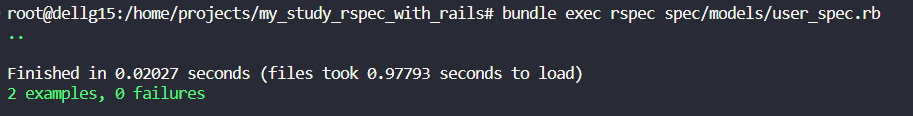
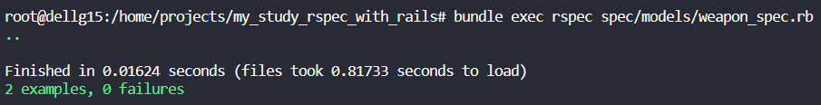
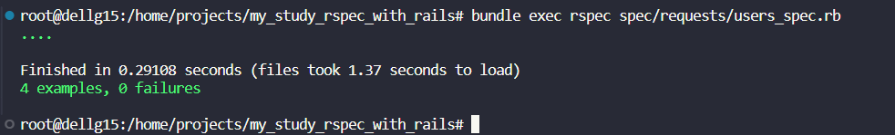
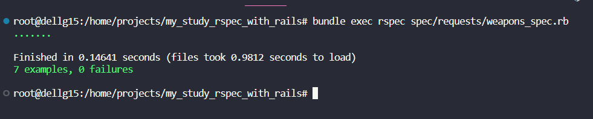
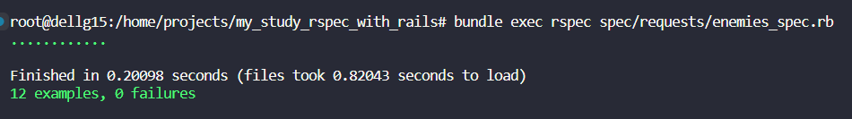

# Projeto testes Ruby com Rspec

Este é o projeto de estudo RSpec com Rails, desenvolvido para praticar testes automatizados com a gem RSpec em uma aplicação Rails.

## Objetivo

O objetivo deste projeto é aprender e praticar os conceitos de testes automatizados em Ruby on Rails, utilizando a biblioteca RSpec.

## Estrutura do Projeto

O projeto consiste em uma aplicação Rails com as seguintes funcionalidades:

- CRUD (Create, Read, Update, Delete) de Usuários
- CRUD de Armas (Weapons)
- CRUD de Inimigos (Enemies)

Além disso, inclui testes automatizados para as funcionalidades principais da aplicação.

## Configuração

Para executar este projeto localmente, siga estas etapas:

1. Certifique-se de ter o Ruby e o Ruby on Rails instalados em seu sistema.
2. Clone este repositório em sua máquina local.
3. Navegue até o diretório do projeto e execute `bundle install` para instalar as dependências do Ruby.
4. Execute `rails db:migrate` para criar o banco de dados e executar as migrações.
5. Opcionalmente, execute `rails db:seed` para popular o banco de dados com alguns dados de exemplo.
6. Execute `rails server` para iniciar o servidor Rails.
7. Abra um navegador da web e acesse `http://localhost:3000` para visualizar a aplicação.

## Testes Automatizados

Este projeto inclui testes automatizados escritos com a biblioteca RSpec. Para executar os testes, execute o seguinte comando no terminal:

```
bundle exec rspec
```

## Screenshots

### Teste De Model




### Teste De request






## Resoluçao de erros 

Apresento os erros que ocorreram no projeto, e como eu conseguir solucionar, visando a ajudar quem pode passar por evental problema caso queira usar este repositorio como exemplo.


## Contribuição

Contribuições são bem-vindas! Se você quiser melhorar este projeto ou reportar problemas, sinta-se à vontade para abrir uma issue ou enviar um pull request.

## Licença

Este projeto está licenciado sob a [MIT License](LICENSE).

---

